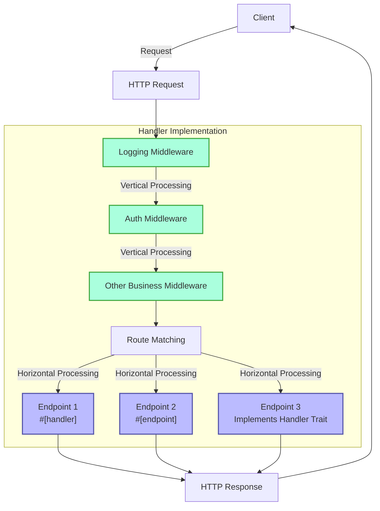
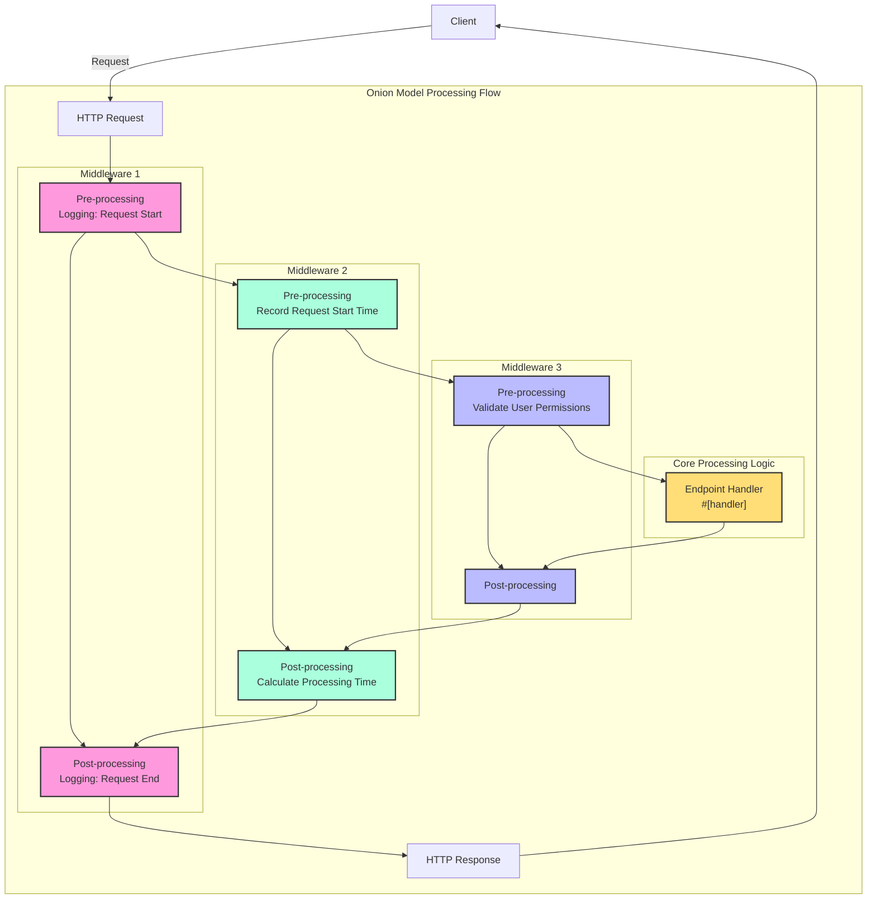

```mermaid
flowchart TD
    subgraph MainGraph[Salvo Framework Request Lifecycle]
        Start[Client Request] --> Convert[Service converts HTTP request to Salvo Response]
        
        %% Routing Matching Phase
        subgraph RoutingPhase[1. Routing Matching Phase]
            Convert --> Routing[Match routes in added order, outer to inner, top to bottom]
            Routing --> FilterCheck{Do all filters pass?}
            FilterCheck -->|No| NextRoute[Try next route]
            FilterCheck -->|Yes| PathConsume[Consume matched path segment]
            PathConsume --> PathCheck{Is path fully consumed with a goal Handler?}
            PathCheck -->|No| SubRouteCheck{Are there sub-routes to continue matching?}
            SubRouteCheck -->|Yes| Routing
            SubRouteCheck -->|No| NextRoute
            NextRoute --> RouteLeft{Are there other routes?}
            RouteLeft -->|Yes| Routing
            RouteLeft -->|No| NoMatchRoute[Routing match failed]
            PathCheck -->|Yes| MatchSuccess[Routing match successful]
            MatchSuccess --> CollectHandlers[Collect all Handlers from the matching chain]
        end
        
        %% Handler Execution Phase
        subgraph HandlerPhase[2. Handler Execution Phase]
            CollectHandlers --> ExecHandlers[Execute Handlers sequentially]
            ExecHandlers --> ErrorCheck{Error or redirect during execution?}
            ErrorCheck -->|No| FinishHandlers[All Handlers executed]
            ErrorCheck -->|Yes| StatusCheck{Is status code an error and Body unset or Error?}
            StatusCheck -->|Yes| EnterCatcher[Enter error-catching phase]
            StatusCheck -->|No| SkipCatcher[Skip error-catching phase]
        end
        
        %% Error-Catching Phase
        subgraph CatcherPhase[3. Error-Catching Phase]
            EnterCatcher --> CatcherHandlers[Execute Catcher's Handlers sequentially]
            NoMatchRoute --> CatcherHandlers
            CatcherHandlers --> DefaultHandler[DefaultGoal or custom error handling]
        end
        
        %% Final Response
        FinishHandlers --> FinalConvert[Service converts Salvo Response to Hyper Response]
        SkipCatcher --> FinalConvert
        DefaultHandler --> FinalConvert
        
        FinalConvert --> End[Return response to client]
    end
    
    %% Styling
    class RoutingPhase,HandlerPhase,CatcherPhase phase;
    class MainGraph mainGraph;
    classDef mainGraph fill:#f5f5f5,stroke:#333,stroke-width:1px;
    classDef phase fill:#e6f3ff,stroke:#333,stroke-width:2px;
```

# Salvo-Rust - Concepts

**Pages:** 30

---

## Logging Middleware

**URL:** llms-txt#logging-middleware

Logging plays a crucial role in web applications, as it enables:

- Providing detailed information about the request handling process to help developers track application behavior
- Assisting in troubleshooting and debugging, especially in production environments
- Monitoring application performance and resource usage
- Recording user access patterns and system exceptions
- Meeting security auditing and compliance requirements

Salvo provides a middleware with basic logging functionality. If the middleware is added directly to a `Router`, it will not capture 404 errors returned when no `Router` matches the request. It is recommended to add it to the `Service` instead.

---
url: /guide/features/open-telemetry.md
---

**Examples:**

Example 1 (unknown):
```unknown
**Cargo.toml**
```

---

## Request Chain ID

**URL:** llms-txt#request-chain-id

The Request ID middleware is highly flexible. The ID generator (IdGenerator) is used to generate IDs, and you can define your own ID generator as long as it implements the `IdGenerator` trait. The default generator provided is `UlidGenerator`.

Additionally, you can control whether to overwrite an existing `requestid`. You can also set `header_name` and other configurations. For details, please [refer to the documentation](https://docs.rs/salvo_extra/latest/salvo_extra/request_id/index.html).

---
url: /guide/features/serve-static.md
---

**Examples:**

Example 1 (unknown):
```unknown
**Cargo.toml**
```

---

## Request Struct Method Overview

**URL:** llms-txt#request-struct-method-overview

| Category               | Method                                 | Description                                 |
| ---------------------- | -------------------------------------- | ------------------------------------------- |
| **Request Info**       | `uri()/uri_mut()/set_uri()`            | URI operations                              |
|                        | `method()/method_mut()`                | HTTP method operations                      |
|                        | `version()/version_mut()`              | HTTP version operations                     |
|                        | `scheme()/scheme_mut()`                | Protocol scheme operations                  |
|                        | `remote_addr()/local_addr()`           | Address information                         |
| **Request Headers**    | `headers()/headers_mut()`              | Get all request headers                     |
|                        | `header<T>()/try_header<T>()`          | Get and parse a specific header             |
|                        | `add_header()`                         | Add a request header                        |
|                        | `content_type()/accept()`              | Get content type/accept type                |
| **Parameter Handling** | `params()/param<T>()`                  | Path parameter operations                   |
|                        | `queries()/query<T>()`                 | Query parameter operations                  |
|                        | `form<T>()/form_or_query<T>()`         | Form data operations                        |
| **Request Body**       | `body()/body_mut()`                    | Get the request body                        |
|                        | `replace_body()/take_body()`           | Modify/extract the request body             |
|                        | `payload()/payload_with_max_size()`    | Get raw data                                |
| **File Handling**      | `file()/files()/all_files()`           | Get uploaded files                          |
|                        | `first_file()`                         | Get the first file                          |
| **Data Parsing**       | `extract<T>()`                         | Unified data extraction                     |
|                        | `parse_json<T>()/parse_form<T>()`      | Parse JSON/form                             |
|                        | `parse_body<T>()`                      | Intelligently parse the request body        |
|                        | `parse_params<T>()/parse_queries<T>()` | Parse parameters/queries                    |
| **Special Features**   | `cookies()/cookie()`                   | Cookie operations (requires cookie feature) |
|                        | `extensions()/extensions_mut()`        | Extension data storage                      |
|                        | `set_secure_max_size()`                | Set secure size limit                       |

---
url: /guide/concepts/response.md
---

---

## Concurrency Limitation

**URL:** llms-txt#concurrency-limitation

**Contents:**
- Application Scenarios
- Main Functions
- Usage

The Concurrency Limiter middleware can control the number of concurrent requests. For specific API details, please [refer to the documentation](https://docs.rs/salvo_extra/latest/salvo_extra/concurrency_limiter/index.html).

## Application Scenarios

The concurrency limiter is particularly useful in the following scenarios:

- **High-Traffic Website Protection**: Limits the number of simultaneously processed requests during traffic surges to prevent server overload.
- **Resource-Intensive Operation Control**: Restricts concurrency for resource-intensive operations such as file uploads and database writes.
- **Third-Party API Call Limitation**: Controls concurrent request numbers when calling external services with rate limits.

- **Prevent Server Overload**: Maintains server stability during traffic peaks by limiting concurrent requests.
- **Enhance System Reliability**: Avoids system crashes caused by resource exhaustion.
- **Optimize Resource Allocation**: Ensures critical services have sufficient resources to handle requests.

Simply add the `max_concurrency(n)` middleware to your route, where `n` is the maximum allowed concurrent requests. Requests exceeding this limit will receive a `503 Service Unavailable` response.

---
url: /guide/features/cors.md
---

**Examples:**

Example 1 (unknown):
```unknown
**Cargo.toml**
```

---

## Router

**URL:** llms-txt#router

**Contents:**
- What is Routing
- Flat Definition
- Tree-like Definition
- Retrieving Parameters from Routes
- Adding Middleware
- Filters
  - Path Filter
  - Method Filter
- Custom Wisp
- Coming from a Controller-based Web Framework, How to Understand Router?

[`Router`](https://docs.rs/salvo_core/latest/salvo_core/routing/struct.Router.html) defines which middleware and `Handler` will process an HTTP request. This is the most fundamental and core functionality in Salvo.

Internally, a `Router` is essentially composed of a series of filters. When a request arrives, the router tests itself and its descendants in order, from top to bottom, to see if they can match the request. If a match is successful, the middleware on the entire chain formed by the router and its descendant routers are executed sequentially. If during processing, the `Response` status is set to an error (4XX, 5XX) or a redirect (3XX), subsequent middleware and `Handler` will be skipped. You can also manually call `ctrl.skip_rest()` to skip the remaining middleware and `Handler`.

During the matching process, there exists a URL path information object, which can be considered as an object that must be completely consumed by filters during matching. If all filters in a certain Router match successfully, and this URL path information has been fully consumed, it is considered a "successful match".

Is actually equivalent to:

If accessing `GET /articles/`, it is considered a successful match, and `list_articles` is executed. However, if accessing `GET /articles/123`, the route match fails and returns a 404 error because `Router::with_path("articles")` only consumes the `/articles` part of the URL path information, leaving the `/123` part unconsumed, thus the match is considered failed. To achieve a successful match, the route can be changed to:

Here, `{**}` matches any remaining path, so it can match `GET /articles/123` and execute `list_articles`.

We can define routes in a flat style:

## Tree-like Definition

We can also define routes in a tree-like structure, which is the recommended approach:

This form of definition makes Router definitions hierarchical, clear, and simple for complex projects.

Many methods in `Router` return `Self` after being called, facilitating chained code writing. Sometimes, you need to decide how to route based on certain conditions. The routing system also provides the `then` function, which is easy to use:

This example means that routes for creating, editing, and deleting articles are only added when the server is in `admin_mode`.

## Retrieving Parameters from Routes

In the code above, `{id}` defines a parameter. We can retrieve its value through the `Request` instance:

`{id}` matches a segment in the path. Normally, an article's `id` is just a number. In this case, we can use a regular expression to restrict the matching rule for `id`, like `r"{id|\d+}"`.

For numeric types, there's an even simpler method using `<id:num>`. Specific notations are:

- `{id:num}` matches any number of digit characters.
- `{id:num[10]}` matches exactly a specific number of digit characters; here, 10 means it matches exactly 10 digits.
- `{id:num(..10)}` matches 1 to 9 digit characters.
- `{id:num(3..10)}` matches 3 to 9 digit characters.
- `{id:num(..=10)}` matches 1 to 10 digit characters.
- `{id:num(3..=10)}` matches 3 to 10 digit characters.
- `{id:num(10..)}` matches at least 10 digit characters.

You can also match all remaining path segments using `{**}`, `{*+}`, or `{*?}`. For better code readability, you can add appropriate names to make the path semantics clearer, e.g., `{**file_path}`.

- `{**}`: Represents a wildcard match where the matched part can be an empty string. For example, the path `/files/{**rest_path}` matches `/files`, `/files/abc.txt`, `/files/dir/abc.txt`.
- `{*+}`: Represents a wildcard match where the matched part must exist and cannot be an empty string. For example, the path `/files/{*+rest_path}` does NOT match `/files` but matches `/files/abc.txt`, `/files/dir/abc.txt`.
- `{*?}`: Represents a wildcard match where the matched part can be an empty string but can only contain one path segment. For example, the path `/files/{*？rest_path}` does NOT match `/files/dir/abc.txt` but matches `/files`, `/files/abc.txt`.

Multiple expressions can be combined to match the same path segment, e.g., `/articles/article_{id:num}/`, `/images/{name}.{ext}`.

Middleware can be added via the `hoop` function on a router:

In this example, the root router uses `check_authed` to check if the current user is logged in. All descendant routers are affected by this middleware.

If users are only browsing `writer` information and articles, we might prefer they can browse without logging in. We can define the routes like this:

Even though two routers have the same path definition `path("articles")`, they can still be added to the same parent router.

`Router` internally uses filters to determine if a route matches. Filters support basic logical operations using `or` or `and`. A router can contain multiple filters; when all filters match successfully, the route matches successfully.

Website path information is a tree structure, but this tree structure is not equivalent to the tree structure organizing routers. A website path may correspond to multiple router nodes. For example, some content under the `articles/` path may require login to view, while others do not. We can organize subpaths requiring login verification under a router containing login verification middleware, and those not requiring verification under another router without it:

Routers use filters to filter requests and send them to the corresponding middleware and `Handler` for processing.

`path` and `method` are two of the most commonly used filters. `path` is used to match path information; `method` is used to match the request's Method, e.g., GET, POST, PATCH, etc.

We can connect router filters using `and`, `or`:

Filters based on request paths are the most frequently used. Path filters can define parameters, for example:

In a `Handler`, they can be retrieved via the `Request` object's `get_param` function:

Filters requests based on the HTTP request's `Method`, for example:

Here, `get`, `patch`, `delete` are all Method filters. This is actually equivalent to:

For certain frequently occurring matching expressions, we can assign a short name via `PathFilter::register_wisp_regex` or `PathFilter::register_wisp_builder`. For instance, GUID format often appears in paths. The normal way is to write it like this every time matching is needed:

Writing this complex regex every time is error-prone and makes code less readable. You can do this instead:

You only need to register it once. Afterwards, you can directly use simple notation like `{id:guid}` to match GUIDs, simplifying code writing.

## Coming from a Controller-based Web Framework, How to Understand Router?

The main differences between routing-designed web frameworks (like Salvo) and traditional MVC or Controller-designed frameworks are:

- **Flexibility**: Routing design allows for more flexible definition of request processing flows, enabling precise control over the logic for each path. For example, in Salvo you can directly define handler functions for specific paths:
  
  In Controller design, you typically need to define a controller class first, then define multiple methods within the class to handle different requests:

- **Middleware Integration**: Routing frameworks usually provide a more concise way to integrate middleware, allowing middleware to be applied to specific routes. Salvo's middleware can be precisely applied to particular routes:

- **Code Organization**: Routing design tends to organize code based on functionality or API endpoints, rather than the Model-View-Controller layering of MVC.
  Routing design encourages organizing code according to API endpoint functionality:

- **Lightweight**: Routing design is typically more lightweight, reducing framework-enforced concepts and constraints. You can introduce only the components you need without following a strict framework structure.

Routing design makes API development more intuitive, especially suitable for building modern microservices and RESTful APIs. In frameworks like Salvo, routing is a core concept that directly reflects the structure and behavior of the API, making the code easier to understand and maintain. In contrast, traditional Controller design often requires more configuration and conventions to achieve the same functionality.

**Examples:**

Example 1 (rust):
```rust
Router::with_path("articles").get(list_articles).post(create_article);
```

Example 2 (rust):
```rust
Router::new()
    // PathFilter can filter request paths. It only matches successfully if the request path contains the "articles" segment.
    // Otherwise, the match fails. For example: /articles/123 matches successfully, while /articles_list/123
    // contains "articles" but fails to match because of the trailing "_list".
    .filter(PathFilter::new("articles"))

    // If the root matches successfully and the request method is GET, the inner child router can match successfully,
    // and the request is handled by list_articles.
    .push(Router::new().filter(filters::get()).handle(list_articles))

    // If the root matches successfully and the request method is POST, the inner child router can match successfully,
    // and the request is handled by create_article.
    .push(Router::new().filter(filters::post()).handle(create_article));
```

Example 3 (rust):
```rust
Router::with_path("articles/{**}").get(list_articles).post(create_article);
```

Example 4 (rust):
```rust
Router::with_path("writers").get(list_writers).post(create_writer);
Router::with_path("writers/{id}").get(show_writer).patch(edit_writer).delete(delete_writer);
Router::with_path("writers/{id}/articles").get(list_writer_articles);
```

---

## Overview of Response Struct Methods

**URL:** llms-txt#overview-of-response-struct-methods

| Category             | Method                         | Description                                       |
| -------------------- | ------------------------------ | ------------------------------------------------- |
| **Creation**         | `new()` / `with_cookies()`     | Create a new response                             |
| **Status Code**      | `status_code()`                | Set the status code                               |
| **Headers**          | `headers()/headers_mut()`      | Get headers                                       |
|                      | `set_headers()/add_header()`   | Set/Add headers                                   |
|                      | `content_type()`               | Get content type                                  |
| **HTTP Version**     | `version()/version_mut()`      | Get/Modify HTTP version                           |
| **Response Body**    | `body()/body_mut()`            | Set/Get the response body                         |
|                      | `replace_body()/take_body()`   | Replace/Extract the response body                 |
|                      | `write_body()`                 | Write data to the response body                   |
|                      | `stream()/channel()`           | Stream response / Create a sending channel        |
| **Cookie Handling**  | `cookies()/cookie()`           | Get cookies / Get a specific cookie               |
|                      | `add_cookie()/remove_cookie()` | Add/Remove a cookie                               |
| **Content Response** | `render()`                     | Render content                                    |
|                      | `stuff()`                      | Set status code and render content                |
|                      | `send_file()`                  | Send a file                                       |
| **Status Query**     | `is_stamped()`                 | Check if the response is ready to be written back |

---
url: /guide/concepts/depot.md
---

---

## WebSocket

**URL:** llms-txt#websocket

**Contents:**
- Introduction to WebSocket
  - Chat Application Example

A middleware that provides support for `WebSocket`.

## Introduction to WebSocket

WebSocket is a protocol that enables full-duplex communication over a single TCP connection. It simplifies data exchange between clients and servers by allowing the server to actively push data to the client. In the WebSocket protocol, the browser and server only need to perform a handshake once to establish a persistent connection and enable bidirectional data transmission.

Unlike traditional HTTP requests, a WebSocket connection remains open after being established, avoiding frequent connection setup and teardown, which significantly reduces communication overhead. This makes WebSocket particularly suitable for real-time applications, such as online games, chat applications, stock tickers, and other applications that require real-time updates.

Salvo provides a concise and powerful API through its WebSocket middleware, enabling developers to easily integrate WebSocket functionality into their applications.

### Chat Application Example

---
url: /guide/features/webtransport.md
---

**Examples:**

Example 1 (unknown):
```unknown
**Cargo.toml**
```

Example 2 (unknown):
```unknown
### Chat Application Example


**main.rs**
```

Example 3 (unknown):
```unknown
**Cargo.toml**
```

---

## Response

**URL:** llms-txt#response

**Contents:**
- Writing Content
- Writing HTTP Errors
- Redirecting to Another URL
- ResBody

In a `Handler`, the [`Response`](https://docs.rs/salvo_core/latest/salvo_core/http/response/struct.Response.html) is passed as a parameter:

- The `Response` struct encapsulates all components of an HTTP response, providing a comprehensive API for constructing and manipulating HTTP responses.
- It supports a fluent, chainable style (e.g., `res.status_code(200).body("Hello")`), facilitating the smooth construction of responses.
- Core functionalities include:
  - Setting status codes and headers
  - Manipulating the response body (supporting strings, bytes, files, and streaming data)
  - Managing Cookies
  - Multiple content rendering methods
- This struct employs a mutable reference pattern, returning a reference to itself via `&mut self`, allowing handlers to conveniently build and customize HTTP responses to meet various web service requirements.

After the server receives a client request, any matched `Handler` or middleware can write data into the `Response`. In certain scenarios, such as when a middleware wishes to prevent the execution of subsequent middleware and `Handler`s, you can use `FlowCtrl`:

Writing data to a `Response` is straightforward:

- Writing plain text data

- Writing JSON serialized data

:::warning
If the `render` method is called multiple times to write JSON data, these pieces of data will not be merged into a single JSON object. Instead, they will be concatenated sequentially as independent text fragments, potentially resulting in invalid JSON format. If multiple data items need to be returned, they should be combined into a single object before serialization, or the logic should be handled manually.
:::

## Writing HTTP Errors

- Using `render` allows writing detailed error information to the `Response`.

- If custom error information is not needed, you can directly call `set_http_code`.

## Redirecting to Another URL

- Using the `render` method, you can write a redirect response to the `Response`, navigating to a new URL. When you call `Redirect::found`, it sets the HTTP status code to 302 (Found), indicating a temporary redirect.

The Body type returned by Response is `ResBody`, which is an enum. In case of an error, it is set to `ResBody::Error`, containing error information for deferred error handling. Notably, `StatusError` does not implement `Writer`; this design allows you to customize its display in the `Catcher`.

**Examples:**

Example 1 (rust):
```rust
#[handler]
async fn hello_world(res: &mut Response) {
    res.render("Hello world!");
}
```

Example 2 (rust):
```rust
#[handler]
async fn hello_world(res: &mut Response, ctrl: &mut FlowCtrl) {
    ctrl.skip_rest();
    res.render("Hello world!");
}
```

Example 3 (rust):
```rust
res.render("Hello world!");
```

Example 4 (rust):
```rust
use serde::Serialize;
  use salvo::prelude::Json;

  #[derive(Serialize, Debug)]
  struct User {
      name: String,
  }
  let user = User{name: "jobs".to_string()};
  res.render(Json(user));
```

---

## Router Struct Method Overview

**URL:** llms-txt#router-struct-method-overview

| Category                | Method                              | Description                                         |
| ----------------------- | ----------------------------------- | --------------------------------------------------- |
| **Creation/Access**     | `new()`                             | Creates a new router                                |
|                         | `routers()/routers_mut()`           | Gets a reference/mutable reference to child routers |
|                         | `hoops()/hoops_mut()`               | Gets a reference/mutable reference to middleware    |
|                         | `filters()/filters_mut()`           | Gets a reference/mutable reference to filters       |
| **Router Organization** | `unshift()`                         | Inserts a child router at the beginning             |
|                         | `insert()`                          | Inserts a child router at a specified position      |
|                         | `push()`                            | Adds a child router                                 |
|                         | `append()`                          | Adds multiple child routers                         |
|                         | `then()`                            | Customizes router chain configuration               |
| **Middleware**          | `with_hoop()/hoop()`                | Creates/adds middleware                             |
|                         | `with_hoop_when()/hoop_when()`      | Creates/adds conditional middleware                 |
| **Path Filtering**      | `with_path()/path()`                | Creates/adds a path filter                          |
|                         | `with_filter()/filter()`            | Creates/adds a filter                               |
|                         | `with_filter_fn()/filter_fn()`      | Creates/adds a function filter                      |
| **Network Filtering**   | `scheme()`                          | Adds a protocol filter                              |
|                         | `host()/with_host()`                | Adds/creates a host filter                          |
|                         | `port()/with_port()`                | Adds/creates a port filter                          |
| **HTTP Methods**        | `get()/post()/put()`                | Creates a route for the corresponding HTTP method   |
|                         | `delete()/patch()/head()/options()` | Creates a route for the corresponding HTTP method   |
| **Handler**             | `goal()`                            | Sets the route handler                              |
| **Match Detection**     | `detect()`                          | Detects if the router matches the request           |

---
url: /guide/concepts/request.md
---

---

## Static Server

**URL:** llms-txt#static-server

**Contents:**
- Use Cases
- Main Features
- Pros and Cons of rust-embed

Middleware that serves static files or embedded files. For detailed API, please [view the documentation](https://docs.rs/salvo_extra/latest/salvo_extra/request_id/index.html).

Static file servers have a wide range of applications in web development:

- Serving static resources for websites, such as CSS, JavaScript, images, etc.
- Hosting Single Page Applications (SPAs)
- Distributing documents, media files, downloadable content, etc.
- Serving as a complete hosting solution for simple websites

- `StaticDir` provides support for serving static files from local directories. It can accept a list of multiple directories as parameters. For example:

If a file is not found in the first directory, it will be searched for in the second directory.

`StaticDir` supports serving pre-compressed files when available. For example, if files like `index.html`, `index.html.gz`, `index.html.zst`, and `index.html.br` exist, then `index.html.gz`, `index.html.zst`, and `index.html.br` are considered pre-compressed versions of `index.html`. The appropriate compressed file will be served based on the request information.

- Provides support for `rust-embed`. For example:

## Pros and Cons of rust-embed

- Compiles static files into the binary, simplifying deployment.
- No need to manage static files separately in production environments.
- Potentially better performance (memory access vs. disk I/O).
- Enhanced security, as files cannot be accidentally modified.

- Increases the size of the application binary.
- Updating static content requires recompiling and redeploying the entire application.
- Not suitable for large static content that changes frequently.

You can set a default page to display using the `default` option. The `with_fallback` and `fallback` methods allow you to specify a fallback file to serve when a requested file is not found, which is useful for certain single-page website applications.

---
url: /guide/features/session.md
---

**Examples:**

Example 1 (unknown):
```unknown
**Cargo.toml**
```

Example 2 (unknown):
```unknown
If a file is not found in the first directory, it will be searched for in the second directory.

`StaticDir` supports serving pre-compressed files when available. For example, if files like `index.html`, `index.html.gz`, `index.html.zst`, and `index.html.br` exist, then `index.html.gz`, `index.html.zst`, and `index.html.br` are considered pre-compressed versions of `index.html`. The appropriate compressed file will be served based on the request information.

- Provides support for `rust-embed`. For example:

## Pros and Cons of rust-embed

**Pros:**

- Compiles static files into the binary, simplifying deployment.
- No need to manage static files separately in production environments.
- Potentially better performance (memory access vs. disk I/O).
- Enhanced security, as files cannot be accidentally modified.

**Cons:**

- Increases the size of the application binary.
- Updating static content requires recompiling and redeploying the entire application.
- Not suitable for large static content that changes frequently.


**main.rs**
```

Example 3 (unknown):
```unknown
**Cargo.toml**
```

---

## Cache

**URL:** llms-txt#cache

**Contents:**
- Main Features
- Quick Migration from Other Frameworks
  - Rust Framework Migration Guide
  - Migration Guide for Frameworks in Other Languages

Middleware that provides caching functionality.

The Cache middleware can cache the `StatusCode`, `Headers`, and `Body` of a `Response`. For content that has already been cached, the Cache middleware will directly send the cached content from memory to the client when processing subsequent requests.

Note: This plugin does not cache `Response` objects whose `Body` is `ResBody::Stream`. If applied to such a `Response`, Cache will not process these requests, and no error will occur.

- `CacheIssuer` provides an abstraction for generating cache keys. `RequestIssuer` is one of its implementations, allowing you to define which parts of the request URL and the request `Method` should be used to generate the cache key. You can also define your own cache key generation logic. The cache key does not necessarily have to be a string; any type that satisfies the `Hash + Eq + Send + Sync + 'static` constraints can be used as a key.

- `CacheStore` provides operations for storing and retrieving data. `MokaStore` is a built-in memory-based cache implementation based on `moka`. You can also define your own implementation.

- `Cache` is a struct that implements `Handler`. It also contains an internal `skipper` field, which can be used to specify requests that should skip caching. By default, it uses `MethodSkipper` to skip all requests except those with `Method::GET`.

Example internal implementation code:

## Quick Migration from Other Frameworks

If you have used caching mechanisms in other frameworks, the following conceptual mappings will help you adapt to Salvo's caching implementation more quickly:

### Rust Framework Migration Guide

- **Migrating from Actix-web**: Plugins like `actix-web-cache` in Actix-web typically need to be introduced separately, whereas caching in Salvo is part of the core library.

### Migration Guide for Frameworks in Other Languages

- **Migrating from Go/Gin**: Gin uses a middleware pattern, which Salvo also adopts in a similar manner:

- **Migrating from Spring Boot**: Spring Boot's declarative caching needs to be converted to Salvo's explicit middleware configuration:

- **Migrating from Express.js**: Express's caching middleware is conceptually similar to Salvo's, but the syntax differs:

When migrating from other frameworks, pay attention to several key concepts of Salvo's caching:

1. **Cache Key Generation** - Controlled via the `CacheIssuer` interface.
2. **Cache Storage** - Implemented via the `CacheStore` interface.
3. **Cache Skipping Logic** - Customized via the `skipper` mechanism.

By default, Salvo only caches GET requests, which aligns with the default behavior of most frameworks.

---
url: /guide/features/caching-headers.md
---

**Examples:**

Example 1 (rust):
```rust
impl<S, I> Cache<S, I> {
    pub fn new(store: S, issuer: I) -> Self {
        let skipper = MethodSkipper::new().skip_all().skip_get(false);
        Cache {
            store,
            issuer,
            skipper: Box::new(skipper),
        }
    }
  }
```

Example 2 (rust):
```rust
// Actix-web cache example
  use actix_web_cache::Cache;
  App::new().wrap(Cache::new().ttl(30))

  // Corresponding Salvo implementation
  use salvo::prelude::*;
  Router::new().hoop(Cache::new(MokaStore::new(100), RequestIssuer::new()))
```

Example 3 (go):
```go
// Gin cache example
  store := persist.NewMemoryStore(time.Second * 60)
  router.Use(cache.CachePage(store, time.Second * 30))
```

Example 4 (rust):
```rust
// Corresponding Salvo implementation
  let store = MokaStore::new(100).with_ttl(Duration::from_secs(30));
  router.hoop(Cache::new(store, RequestIssuer::new()))
```

---

## Depot

**URL:** llms-txt#depot

**Contents:**
- Quick Understanding
- Setting and Retrieving Data via `insert` and `get`
- Setting and Retrieving Data via `inject` and `obtain`

[Depot](https://docs.rs/salvo_core/latest/salvo_core/struct.Depot.html) is used to store temporary data involved in a single request. Middleware can place the temporary data it processes into the Depot for use by subsequent programs.

When a server receives a request from a client browser, it creates an instance of `Depot`. This instance is destroyed after all middleware and `Handler` have finished processing the request.

For example, we can set `current_user` in a login middleware and then read the current user information in subsequent middleware or `Handler`.

## Quick Understanding

`Depot` is used to store and share data during request processing. It implements a type-safe data container that supports two main usage patterns:

1. **Key-Value Storage**: Access values associated with string keys via `insert`/`get` methods.
2. **Type Injection**: Store and retrieve values based on type via `inject`/`obtain` methods.

As shown in the examples, `Depot` is particularly useful for passing data between middleware and handlers. Middleware can set values in `Depot` (such as user information, authentication status), and subsequent handlers can retrieve these values without redundant calculations or queries. The design of `Depot` ensures data consistency and accessibility throughout the entire request processing chain, making it a core tool for building complex web applications.

## Setting and Retrieving Data via `insert` and `get`

As shown above, you can insert `key` and `value` into `Depot` using `insert`. For values of this type, you can directly retrieve them using `get`.

If the `key` does not exist, or if the `key` exists but the type does not match, it returns `None`.

## Setting and Retrieving Data via `inject` and `obtain`

Sometimes, there are scenarios where a unique instance exists for a type without needing to relate to a specific `key`. You can use `inject` to insert data and then use `obtain` to retrieve it. These methods do not require you to provide a `key`.

**Examples:**

Example 1 (unknown):
```unknown
**Cargo.toml**
```

Example 2 (unknown):
```unknown
## Setting and Retrieving Data via `insert` and `get`

As shown above, you can insert `key` and `value` into `Depot` using `insert`. For values of this type, you can directly retrieve them using `get`.
```

Example 3 (unknown):
```unknown
If the `key` does not exist, or if the `key` exists but the type does not match, it returns `None`.

## Setting and Retrieving Data via `inject` and `obtain`

Sometimes, there are scenarios where a unique instance exists for a type without needing to relate to a specific `key`. You can use `inject` to insert data and then use `obtain` to retrieve it. These methods do not require you to provide a `key`.
```

---

## Sending Files

**URL:** llms-txt#sending-files

**Contents:**
  - NamedFile
  - Serve Static

Salvo can send files in several ways:

Salvo provides `salvo::fs::NamedFile`, which can be used to efficiently send files to clients. It does not load the entire file into memory; instead, it reads and sends only the portions requested by the client based on the `Range` header.

In practice, using `Response::send_file` is a simplified way to utilize `NamedFile`. If you need more control over file delivery, you can use `NamedFileBuilder`.

You can create a `NamedFileBuilder` via `NamedFile::builder`:

After configuring the builder, you can send the file:

Middleware for serving static files or embedded files.

- `StaticDir` provides support for serving static files from local directories. You can pass a list of multiple directories as arguments. For example:

If a file is not found in the first directory, it will be searched for in the second directory.

- Provides support for `rust-embed`. For example:

The `with_fallback` method allows you to specify a fallback file to serve when the requested file is not found. This is particularly useful for single-page applications (SPAs).

---
url: /guide/topics/working-with-database.md
---

**Examples:**

Example 1 (rust):
```rust
#[handler]
async fn send_file(req: &mut Request, res: &mut Response) {
    let builder = NamedFile::builder("/file/to/path");
}
```

Example 2 (rust):
```rust
#[handler]
async fn send_file(req: &mut Request, res: &mut Response) {
    NamedFile::builder("/file/to/path").attached_name("image.png").send(req.headers(), res).await;
}
```

Example 3 (unknown):
```unknown
**Cargo.toml**
```

Example 4 (unknown):
```unknown
If a file is not found in the first directory, it will be searched for in the second directory.

- Provides support for `rust-embed`. For example:


**main.rs**
```

---

## Catching Panics in Requests

**URL:** llms-txt#catching-panics-in-requests

**Contents:**
- Middleware Introduction
- Basic Usage
- Comparison with Other Frameworks for Quick Concept Understanding
  - Axum
  - Gin (Go)
- Example Code

Catch Panic is used to capture crashes that occur during request processing in the program. For specific APIs, please [refer to the documentation](https://docs.rs/salvo_extra/latest/salvo_extra/catch_panic/index.html).

> **Note**: To use `CatchPanic`, you need to enable the `catch-panic` feature in `Cargo.toml`:
>
>

## Middleware Introduction

`CatchPanic` is a middleware designed to catch panics in handlers. When a panic occurs during request processing, it captures the panic and writes a 500 Internal Server Error to the response, preventing the entire server from crashing.

**Important Note**: This middleware should be used as the first middleware to ensure it can catch panics from other middlewares or handlers.

## Comparison with Other Frameworks for Quick Concept Understanding

Similar to the `catch_panic` middleware in Axum's `Tower`:

In the Go language's Gin framework, similar to the Recovery middleware:

---
url: /guide/features/compression.md
---

**Examples:**

Example 1 (toml):
```toml
> salvo = { version = "xxx", features = ["catch-panic"] }
>
```

Example 2 (rust):
```rust
use salvo_core::prelude::*;
use salvo_extra::catch_panic::CatchPanic;

#[handler]
async fn hello() {
    panic!("panic error!");
}

#[tokio::main]
async fn main() {
    let router = Router::new().hoop(CatchPanic::new()).get(hello);
    let acceptor = TcpListener::new("0.0.0.0:8698").bind().await;
    Server::new(acceptor).serve(router).await;
}
```

Example 3 (rust):
```rust
use axum::{
    Router,
    routing::get,
    http::StatusCode,
};
use tower::ServiceBuilder;
use tower_http::catch_panic::CatchPanicLayer;

async fn panic_handler() -> &'static str {
    panic!("panic error!");
}

#[tokio::main]
async fn main() {
    let app = Router::new()
        .route("/", get(panic_handler))
        .layer(
            ServiceBuilder::new()
                .layer(CatchPanicLayer::new())
        );
    
    axum::Server::bind(&"0.0.0.0:3000".parse().unwrap())
        .serve(app.into_make_service())
        .await
        .unwrap();
}
```

Example 4 (go):
```go
package main

import (
    "github.com/gin-gonic/gin"
)

func main() {
    r := gin.Default() // Includes the Recovery middleware by default
    
    r.GET("/", func(c *gin.Context) {
        panic("panic error!")
    })
    
    r.Run(":8080")
}
```

---

## Affix State Shared Data in Requests

**URL:** llms-txt#affix-state-shared-data-in-requests

**Contents:**
- Feature Analysis
- Comparison with Other Frameworks for Quick Concept Understanding
- Common Use Cases

The Affix State middleware is used to add shared data to the Depot.
To use the Affix State feature, you need to enable the `affix-state` feature in Cargo.toml.

Affix State provides a simple way to share data during request processing. It allows you to:

- Inject global configurations or shared data during route configuration
- Access this data via the Depot in any handler
- Support any cloneable type as state data

## Comparison with Other Frameworks for Quick Concept Understanding

| Framework           | Language   | State Management Approach                                              |
| ------------------- | ---------- | ---------------------------------------------------------------------- |
| Salvo (Affix State) | Rust       | Stores and accesses via Depot, supports multiple types                 |
| Axum                | Rust       | Stores state via Extension, similar but with different usage           |
| Actix-web           | Rust       | Uses App Data and Web::Data to share state                             |
| Gin                 | Go         | Uses context.Set and context.Get to store and retrieve data            |
| Echo                | Go         | Uses context.Set and context.Get to manage shared state                |
| Spring              | Java       | Uses ApplicationContext or @Bean annotations for dependency management |
| Quarkus             | Java       | Uses CDI and dependency injection mechanisms                           |
| Express.js          | JavaScript | Uses app.locals or req.app.locals to store global state                |
| Nest.js             | JavaScript | Uses a dependency injection system to manage shared services           |
| Koa.js              | JavaScript | Uses ctx.state to store request-level state                            |

- Database connection pool sharing
- Application configuration sharing
- Cache instance sharing
- API client sharing
- Global counters or state tracking

The advantage of Affix State lies in its simplicity and flexibility, allowing easy sharing of any type of data across different routes and handlers without extensive boilerplate code.
_**Example Code**_

---
url: /guide/features/basic-auth.md
---

**Examples:**

Example 1 (unknown):
```unknown
**Cargo.toml**
```

---

## Processing Flow

**URL:** llms-txt#processing-flow

**Contents:**
- Routing Matching Phase
- Handler Execution Phase
- Error-Catching Phase
- Salvo Request Lifecycle

`Service` first converts the request into Salvo's `Response`, then enters the routing matching phase.

## Routing Matching Phase

Routing matching runs filters in the order they were added, proceeding from outer to inner and top to bottom. If any filter fails, the match is considered unsuccessful.

During the matching process, the request's path information is consumed progressively. Once a path filter matches successfully, it consumes the matched portion of the path. When all path segments are consumed, and no filter fails along the matching chain, and the last `Router` on the current chain has a `goal` `Handler`, the match is successful, and the matching phase ends. All `Handler`s collected from the matching chain proceed to the execution phase.

If the path is not fully consumed, no errors occur along the chain, but there are no further child routes to continue matching, the current chain is considered a match failure, and the process moves to the next route for matching.

If all routes are matched without success, the process enters the error-catching phase.

## Handler Execution Phase

The `Handler`s collected during the matching phase are executed sequentially. During execution, preceding middleware can call `ctrl::call_next()` to allow subsequent middleware to execute first before running its own logic. If an error status code or a redirect occurs during execution, subsequent `Handler`s will not be executed. If the status code indicates an error and the `Response`'s `Body` is unset or is `ResBody::Error`, the process enters the error-catching phase; otherwise, it skips the catching phase.

## Error-Catching Phase

`Catcher` is a type used to handle errors and can also include middleware (hoops). Errors pass through all `Handler`s within the `Catcher` sequentially. If a `Handler` has already handled the error and does not want subsequent `Handler`s to continue, it can skip the rest using `ctrl.skip_rest()`, directly ending the catching phase.

`Catcher` must include at least one `Handler` as the default error handler. The default is `DefaultGoal`, but you can fully customize your own `Handler` as the default error-handling implementation. It displays error information in the format requested by the `content-type` header, supporting `json`, `xml`, `text`, and `html` formats. `DefaultGoal` also provides display settings; for example, by default, it displays Salvo-related links when showing HTML format. You can call `DefaultGoal::footer` or `DefaultGoal::with_footer` to set a custom footer as desired.

`Service` converts Salvo's `Response` into Hyper's `Response` type, which is ultimately returned to clients such as browsers.

## Salvo Request Lifecycle

This is a visual representation and explanation of the HTTP request lifecycle in the Salvo web framework.

---
url: /guide/topics/handle-error.md
---

**Examples:**

Example 1 (mermaid):


---

## OpenAPI Documentation Generation

**URL:** llms-txt#openapi-documentation-generation

**Contents:**
- Data Extractors
- `#[endpoint]`
- ToSchema
- ToParameters
  - ToParameters Container Attributes for `#[salvo(parameters(...))]`

OpenAPI is an open-source specification for describing RESTful API interface designs. It defines API request and response structures, parameters, return types, error codes, and other details in JSON or YAML format, making communication between client and server more explicit and standardized.

OpenAPI was originally the open-source version of the Swagger specification and has now become an independent project supported by many large enterprises and developers. Using the OpenAPI specification helps development teams collaborate better, reduce communication costs, and improve development efficiency. Additionally, OpenAPI provides developers with tools for automatically generating API documentation, mock data, and test cases, facilitating development and testing work.

Salvo provides OpenAPI integration (modified from [utoipa](https://github.com/juhaku/utoipa)). Salvo elegantly extracts relevant OpenAPI data type information automatically from `Handler` based on its own characteristics. Salvo also integrates several popular open-source OpenAPI interfaces such as SwaggerUI, Scalar, RapiDoc, and ReDoc.

Since Rust type names can be long and not always suitable for OpenAPI usage, `salvo-oapi` provides the `Namer` type, which allows customizing rules to change type names in OpenAPI as needed.

Enter `http://localhost:8698/swagger-ui` in your browser to see the Swagger UI page.

The OpenAPI integration in Salvo is quite elegant. For the example above, compared to a normal Salvo project, we just did the following steps:

- Enable the `oapi` feature in `Cargo.toml`: `salvo = { workspace = true, features = ["oapi"] }`;

- Replace `#[handler]` with `#[endpoint]`;

- Use `name: QueryParam<String, false>` to get the value of the query string. When you visit `http://localhost/hello?name=chris`, the `name` query string will be parsed. The `false` in `QueryParam<String, false>` means that this parameter is optional. If you visit `http://localhost/hello`, it will not report an error. On the contrary, if it is `QueryParam<String, true>`, it means that this parameter must be provided, otherwise an error will be returned.

- Create `OpenAPI` and the corresponding `Router`. The `merge_router` in `OpenApi::new("test api", "0.0.1").merge_router(&router)` means that this `OpenAPI` obtains the necessary document information by parsing a certain route and its sub-routes. Some `Handler`s of routes may not provide information for generating documents, and these routes will be ignored, such as `Handler`s defined using the `#[handler]` macro instead of the `#[endpoint]` macro. That is to say, in actual projects, for reasons such as development progress, you can choose not to generate OpenAPI documents, or partially generate OpenAPI documents. Subsequently, you can gradually increase the number of OpenAPI interfaces generated, and all you need to do is change `#[handler]` to `#[endpoint]` and modify the function signature.

You can import preset common data extractors through `use salvo::oapi::extract::*;`. The extractor will provide some necessary information to Salvo so that Salvo can generate OpenAPI documents.

- `QueryParam<T, const REQUIRED: bool>`: An extractor for extracting data from query strings. `QueryParam<T, false>` means that this parameter is not required and can be omitted. `QueryParam<T, true>` means that this parameter is required and cannot be omitted. If it is not provided, an error will be returned;

- `HeaderParam<T, const REQUIRED: bool>`: An extractor for extracting data from the request header. `HeaderParam<T, false>` means that this parameter is not required and can be omitted. `HeaderParam<T, true>` means that this parameter is required and cannot be omitted. If it is not provided, an error will be returned;

- `CookieParam<T, const REQUIRED: bool>`: An extractor for extracting data from the request cookie. `CookieParam<T, false>` means that this parameter is not required and can be omitted. `CookieParam<T, true>` means that this parameter is required and cannot be omitted. If it is not provided, an error will be returned;

- `PathParam<T>`: An extractor for extracting path parameters from the request URL. If this parameter does not exist, the route matching will not be successful, so there is no case where it can be omitted;

- `FormBody<T>`: Extracts information from the submitted form of the request;

- `JsonBody<T>`: Extracts information from the JSON-formatted payload submitted by the request;

When generating OpenAPI documents, you need to use the `#[endpoint]` macro instead of the regular `#[handler]` macro. It is actually an enhanced version of the `#[handler]` macro.

- It can obtain the necessary information for generating OpenAPI through the function signature;

- For information that is not convenient to provide through the signature, you can directly provide it by adding attributes in the `#[endpoint]` macro. The information provided in this way will be merged with the information obtained through the function signature. If there is a conflict, it will overwrite the information provided by the function signature.

You can use Rust's built-in `#[deprecated]` attribute to mark a Handler as obsolete. Although the `#[deprecated]` attribute supports adding information such as the reason for deprecation and the version, OpenAPI does not support it, so this information will be ignored when generating OpenAPI.

The doc comment part in the code will be automatically extracted to generate OpenAPI. The first line is used to generate _`summary`_, and the entire comment part will be used to generate _`description`_.

You can use `#[derive(ToSchema)]` to define data structures:

You can use `#[salvo(schema(...))]` to define optional settings:

- `example = ...` can be `json!(...)`. `json!(...)` will be parsed by `serde_json::json!` as `serde_json::Value`.

- `xml(...)` can be used to define Xml object properties:

Generate [path parameters][path_parameters] from the fields of the structure.

This is the `#[derive]` implementation of the [`ToParameters`][to_parameters] trait.

Usually, path parameters need to be defined in [`#[salvo_oapi::endpoint(...parameters(...))]`][path_parameters] of the endpoint. However, when using a [`struct`][struct] to define parameters, the above steps can be omitted. Nevertheless, if you need to give a description or change the default configuration, then [`primitive types`][primitive] and [`String`][std_string] path parameters or \[tuple] style path parameters still need to be defined in `parameters(...)`.

You can use Rust's built-in `#[deprecated]` attribute to mark fields as deprecated, which will be reflected in the generated OpenAPI specification.

The `#[deprecated]` attribute supports adding extra information such as the reason for deprecation or the version from which it is deprecated, but OpenAPI does not support it. OpenAPI only supports a boolean value to determine whether it is deprecated. Although it is perfectly possible to declare a deprecation with a reason, such as `#[deprecated  = "There is better way to do this"]`, this reason will not be presented in the OpenAPI specification.

The comment document on the structure field will be used as the parameter description in the generated OpenAPI specification.

### ToParameters Container Attributes for `#[salvo(parameters(...))]`

The following attributes can be used in the container attribute `#[salvo(parameters(…))]` of the structure derived from `ToParameters`

- `names(...)` Defines a comma-separated list of names for the unnamed fields of the structure used as path parameters. Only supported on unnamed structures.
- `style = ...` Defines the serialization method for all parameters, specified by [`ParameterStyle`][style]. The default value is based on the _`parameter_in`_ attribute.
- `default_parameter_in = ...` Defines the default position used by the parameters of this field. The value of this position comes from [`parameter::ParameterIn`][in_enum]. If this attribute is not provided, the default is from `query`.
- `rename_all = ...` can be used as an alternative to `serde`'s `rename_all`. It actually provides the same functionality.

Use `names` to define a name for a single unnamed parameter.

**Examples:**

Example 1 (unknown):
```unknown
**Cargo.toml**
```

Example 2 (unknown):
```unknown
Enter `http://localhost:8698/swagger-ui` in your browser to see the Swagger UI page.

The OpenAPI integration in Salvo is quite elegant. For the example above, compared to a normal Salvo project, we just did the following steps:

- Enable the `oapi` feature in `Cargo.toml`: `salvo = { workspace = true, features = ["oapi"] }`;

- Replace `#[handler]` with `#[endpoint]`;

- Use `name: QueryParam<String, false>` to get the value of the query string. When you visit `http://localhost/hello?name=chris`, the `name` query string will be parsed. The `false` in `QueryParam<String, false>` means that this parameter is optional. If you visit `http://localhost/hello`, it will not report an error. On the contrary, if it is `QueryParam<String, true>`, it means that this parameter must be provided, otherwise an error will be returned.

- Create `OpenAPI` and the corresponding `Router`. The `merge_router` in `OpenApi::new("test api", "0.0.1").merge_router(&router)` means that this `OpenAPI` obtains the necessary document information by parsing a certain route and its sub-routes. Some `Handler`s of routes may not provide information for generating documents, and these routes will be ignored, such as `Handler`s defined using the `#[handler]` macro instead of the `#[endpoint]` macro. That is to say, in actual projects, for reasons such as development progress, you can choose not to generate OpenAPI documents, or partially generate OpenAPI documents. Subsequently, you can gradually increase the number of OpenAPI interfaces generated, and all you need to do is change `#[handler]` to `#[endpoint]` and modify the function signature.

## Data Extractors

You can import preset common data extractors through `use salvo::oapi::extract::*;`. The extractor will provide some necessary information to Salvo so that Salvo can generate OpenAPI documents.

- `QueryParam<T, const REQUIRED: bool>`: An extractor for extracting data from query strings. `QueryParam<T, false>` means that this parameter is not required and can be omitted. `QueryParam<T, true>` means that this parameter is required and cannot be omitted. If it is not provided, an error will be returned;

- `HeaderParam<T, const REQUIRED: bool>`: An extractor for extracting data from the request header. `HeaderParam<T, false>` means that this parameter is not required and can be omitted. `HeaderParam<T, true>` means that this parameter is required and cannot be omitted. If it is not provided, an error will be returned;

- `CookieParam<T, const REQUIRED: bool>`: An extractor for extracting data from the request cookie. `CookieParam<T, false>` means that this parameter is not required and can be omitted. `CookieParam<T, true>` means that this parameter is required and cannot be omitted. If it is not provided, an error will be returned;

- `PathParam<T>`: An extractor for extracting path parameters from the request URL. If this parameter does not exist, the route matching will not be successful, so there is no case where it can be omitted;

- `FormBody<T>`: Extracts information from the submitted form of the request;

- `JsonBody<T>`: Extracts information from the JSON-formatted payload submitted by the request;

## `#[endpoint]`

When generating OpenAPI documents, you need to use the `#[endpoint]` macro instead of the regular `#[handler]` macro. It is actually an enhanced version of the `#[handler]` macro.

- It can obtain the necessary information for generating OpenAPI through the function signature;

- For information that is not convenient to provide through the signature, you can directly provide it by adding attributes in the `#[endpoint]` macro. The information provided in this way will be merged with the information obtained through the function signature. If there is a conflict, it will overwrite the information provided by the function signature.

You can use Rust's built-in `#[deprecated]` attribute to mark a Handler as obsolete. Although the `#[deprecated]` attribute supports adding information such as the reason for deprecation and the version, OpenAPI does not support it, so this information will be ignored when generating OpenAPI.

The doc comment part in the code will be automatically extracted to generate OpenAPI. The first line is used to generate _`summary`_, and the entire comment part will be used to generate _`description`_.
```

Example 3 (unknown):
```unknown
## ToSchema

You can use `#[derive(ToSchema)]` to define data structures:
```

Example 4 (unknown):
```unknown
You can use `#[salvo(schema(...))]` to define optional settings:

- `example = ...` can be `json!(...)`. `json!(...)` will be parsed by `serde_json::json!` as `serde_json::Value`.
```

---

## File Upload Size Limiter Middleware

**URL:** llms-txt#file-upload-size-limiter-middleware

**Contents:**
- Use Cases

A middleware for limiting the size of uploaded files in requests.

Size Limiter is primarily used in the following scenarios:

- Preventing users from uploading excessively large files that consume server resources
- Avoiding server memory overflow caused by malicious attackers uploading massive amounts of data
- Setting different request size limit policies for different API endpoints
- Improving server request processing efficiency and stability

---
url: /guide/features/sse.md
---

**Examples:**

Example 1 (unknown):
```unknown
**Cargo.toml**
```

---

## Tower Middleware Compatibility

**URL:** llms-txt#tower-middleware-compatibility

**Contents:**
- Core Concepts of Tower
  - Service Trait
  - Layer Trait
- Salvo Compatibility Support

Salvo provides compatibility support for the Tower ecosystem through the `tower-compat` feature. For specific APIs, please [refer to the documentation](https://docs.rs/salvo_extra/latest/salvo_extra/tower_compat/index.html).

## Core Concepts of Tower

Tower is a service abstraction library primarily based on two core traits:

The `Service` trait is responsible for handling requests and returning responses, similar to Salvo's handlers.

The `Layer` trait is used to wrap services and add additional functionality, similar to Salvo's middleware.

## Salvo Compatibility Support

Salvo provides two key traits to achieve compatibility with the Tower ecosystem:

- **TowerLayerCompat**: Converts Tower's `Layer` into Salvo's `Handler`, allowing it to be used as a Hoop (middleware).
- **TowerServiceCompat**: Converts Tower's `Service` into Salvo's `Handler`.

---
url: /guide/features/trailing-slash.md
---

**Examples:**

Example 1 (rust):
```rust
pub trait Service<Request> {
    type Response;
    type Error;
    type Future: Future<Output = Result<Self::Response, Self::Error>>;

    fn poll_ready(&mut self, cx: &mut Context<'_>) -> Poll<Result<(), Self::Error>>;
    fn call(&mut self, req: Request) -> Self::Future;
}
```

Example 2 (rust):
```rust
pub trait Layer<S> {
    type Service;
    fn layer(&self, inner: S) -> Self::Service;
}
```

Example 3 (rust):
```rust
// Use Tower's RateLimitLayer and convert it to a Salvo-compatible format via the compat() method
let limit = RateLimitLayer::new(5, Duration::from_secs(30)).compat();
let router = Router::new().hoop(limit).get(hello);
```

Example 4 (unknown):
```unknown
**Cargo.toml**
```

---

## Timeout Middleware

**URL:** llms-txt#timeout-middleware

**Contents:**
- Use Cases

Provides middleware support for timeout handling.

In web services, certain requests may take too long to process due to various reasons (such as slow database queries, delayed external service responses, etc.). To prevent these long-running requests from consuming server resources and affecting the processing of other requests, a timeout middleware can be used to set a maximum processing time limit for requests. If this time limit is exceeded, the request will be automatically terminated, and a timeout error will be returned.

In the example above, we created two handler functions: a fast-responding `fast` and a `slow` that delays for 6 seconds before responding. A timeout limit of 5 seconds is set for all requests using `Timeout::new(Duration::from_secs(5))`. When accessing the `/slow` path, the request will time out because the processing time exceeds the 5-second limit. In contrast, when accessing the `/fast` path, the request will be processed normally and return a result.

---
url: /guide/features/tower-compat.md
---

**Examples:**

Example 1 (unknown):
```unknown
**Cargo.toml**
```

---

## Handler

**URL:** llms-txt#handler

**Contents:**
- Quick Overview
  - Handler Flowchart in Salvo
  - Middleware and the Onion Model
  - Complete Middleware Example Structure
- What is a Handler
- `Handler` as Middleware (hoop)
- Using the `#[handler]` Macro
- Handling Errors
- Directly Implementing the Handler Trait

Handler is a core concept in the Salvo framework, which can be simply understood as a request processing unit. It has two main purposes:

1. **As an Endpoint**: An object implementing `Handler` can be placed into the routing system as the final endpoint to process requests. When using the `#[handler]` macro, a function can be directly used as an endpoint; while using the `#[endpoint]` macro not only allows it to serve as an endpoint but also automatically generates OpenAPI documentation (this will be detailed in subsequent documentation).

2. **As Middleware**: The same `Handler` can also be used as middleware to process requests before or after they reach the final endpoint.

Salvo's request processing flow can be viewed as a "pipeline": a request first passes through a series of middleware (vertical processing) and then reaches the matching endpoint (horizontal processing). Both middleware and endpoints are implementations of `Handler`, which ensures consistency and flexibility throughout the system.

### Handler Flowchart in Salvo

### Middleware and the Onion Model

The essence of the onion model is that by placing `ctrl.call_next()` before and after specific logic, it implements a bidirectional processing flow for requests and responses, allowing each middleware to participate in the complete request-response cycle.

### Complete Middleware Example Structure

A Handler is the concrete object responsible for processing Request objects. Handler itself is a Trait containing an asynchronous `handle` method:

The default signature of the `handle` function includes four parameters, in order: `&mut Request, &mut Depot, &mut Response, &mut FlowCtrl`. Depot is temporary storage that can hold data related to the current request.

Depending on how it's used, it can serve as middleware (hoop), which can perform processing before or after the request reaches the formal request-processing `Handler`, such as: login verification, data compression, etc.

Middleware is added via the `hoop` function of a `Router`. The added middleware affects the current `Router` and all its descendant `Router`s.

A `Handler` can also be used as a `Handler` that participates in route matching and is ultimately executed, known as a `goal`.

## `Handler` as Middleware (hoop)

When a `Handler` acts as middleware, it can be added to the following three types of objects that support middleware:

- `Service`: Any request will pass through the middleware in the `Service`.
- `Router`: Only when route matching succeeds will the request pass through the middleware defined in the `Service` and all middleware collected along the matching path.
- `Catcher`: When an error occurs and no custom error information has been written, the request will pass through the middleware in the `Catcher`.
- `Handler`: The `Handler` itself supports adding middleware wrappers to execute some pre- or post-logic.

## Using the `#[handler]` Macro

The `#[handler]` macro can greatly simplify code writing and improve code flexibility.

It can be applied to a function to make it implement `Handler`:

This is equivalent to:

As you can see, with `#[handler]`, the code becomes much simpler:

- No need to manually add `#[async_trait]`.
- Unnecessary parameters in the function are omitted, and the required parameters can be arranged in any order.
- For objects implementing the `Writer` or `Scribe` abstractions, they can be directly returned as the function's return value. Here, `&'static str` implements `Scribe`, so it can be directly returned.

`#[handler]` can not only be applied to functions but also to the `impl` block of a `struct` to make the `struct` implement `Handler`. In this case, the `handle` function within the `impl` block is recognized as the concrete implementation of the `handle` method in `Handler`:

In Salvo, a `Handler` can return a `Result`, provided that both the `Ok` and `Err` types within the `Result` implement the `Writer` trait.
Considering the widespread use of anyhow, when the `anyhow` feature is enabled, `anyhow::Error` will implement the `Writer` trait. `anyhow::Error` will be mapped to `InternalServerError`.

For custom error types, you can output different error pages as needed.

## Directly Implementing the Handler Trait

---
url: /guide/concepts/catcher.md
---

**Examples:**

Example 1 (mermaid):


Example 2 (rust):
```rust
async fn example_middleware(req: &mut Request, depot: &mut Depot, resp: &mut Response, ctrl: &mut FlowCtrl) {
    // Pre-processing (Request Phase)
    // Place logic to execute when the request enters here.

    // Call the next handler in the chain.
    ctrl.call_next(req, depot, resp).await;

    // Post-processing (Response Phase)
    // Place logic to execute after the request is processed here.
}
```

Example 3 (mermaid):


Example 4 (rust):
```rust
#[async_trait]
pub trait Handler: Send + Sync + 'static {
    async fn handle(&self, req: &mut Request, depot: &mut Depot, res: &mut Response);
}
```

---

## Session

**URL:** llms-txt#session

**Contents:**
- What is Session
- Using Session in Salvo
- Common Use Cases

Middleware providing support for `Session`.

Session refers to user data stored on the server side, typically used to track user state and store temporary data. In web applications, Session addresses the stateless nature of the HTTP protocol, enabling the server to recognize multiple requests from the same user.

## Using Session in Salvo

In Salvo, the Session middleware offers a simple API for reading and writing session data. The `SessionDepot` can be used to obtain a session instance, while methods such as `get`, `set`, and `remove` allow for managing session data.

- User authentication and login state management
- Temporary storage of form data
- Storage of user preference settings

---
url: /guide/features/size-limiter.md
---

**Examples:**

Example 1 (unknown):
```unknown
**Cargo.toml**
```

---

## Response Compression

**URL:** llms-txt#response-compression

**Contents:**
- Data Compression in HTTP Protocol
- Example Code

A middleware for compressing the content of `Response`.

Supports three compression formats: `br`, `gzip`, and `deflate`. The priority and configuration of each compression method can be customized as needed.

## Data Compression in HTTP Protocol

1. File format level: Specific file types use dedicated compression algorithms.
2. HTTP protocol level: End-to-end resource compression transmission is achieved through content encoding.
3. Connection level: Data compression is performed between nodes of an HTTP connection.

For more information about HTTP compression, refer to the [Mozilla Developer Network documentation](https://developer.mozilla.org/en-US/docs/Web/HTTP/Guides/Compression).

---
url: /guide/features/concurrency-limiter.md
---

**Examples:**

Example 1 (unknown):
```unknown
**Cargo.toml**
```

---

## Request

**URL:** llms-txt#request

**Contents:**
- Quick Overview
- Getting Query Parameters
- Getting Form Data
- Getting JSON Deserialized Data
- Extracting Request Data
- Parsing Principle
  - Built-in Extractors
  - Advanced Usage
  - `#[salvo(extract(flatten))]` VS `#[serde(flatten)]`
  - `#[salvo(extract(source(parse)))]`

In Salvo, user request data can be obtained through [`Request`](https://docs.rs/salvo_core/latest/salvo_core/http/request/struct.Request.html):

Request is a struct representing an HTTP request, providing comprehensive request handling capabilities:

- Operates on basic attributes (URI, method, version)
- Handles request headers and Cookies
- Parses various parameters (path, query, form)
- Supports request body processing and file uploads
- Offers multiple data parsing methods (JSON, form, etc.)
- Implements unified type-safe data extraction via the extract method

## Getting Query Parameters

Query parameters can be obtained via `get_query`:

Form data can be obtained via `get_form`. This function is asynchronous:

## Getting JSON Deserialized Data

## Extracting Request Data

`Request` provides multiple methods to parse this data into strongly-typed structures.

- `parse_params`: Parses the request's router params into a specific data type.
- `parse_queries`: Parses the request's URL queries into a specific data type.
- `parse_headers`: Parses the request's HTTP headers into a specific data type.
- `parse_json`: Parses the data in the HTTP body part of the request as JSON format into a specific type.
- `parse_form`: Parses the data in the HTTP body part of the request as a Form into a specific type.
- `parse_body`: Parses the data in the HTTP body part into a specific type based on the request's `content-type`.
- `extract`: Can merge different data sources to parse out a specific type.

Here, a custom `serde::Deserializer` is used to extract data from structures like `HashMap<String, String>` and `HashMap<String, Vec<String>>` into specific data types.

For example: `URL queries` are actually extracted as a [MultiMap](https://docs.rs/multimap/latest/multimap/struct.MultiMap.html) type. `MultiMap` can be thought of as a data structure similar to `HashMap<String, Vec<String>>`. If the requested URL is `http://localhost/users?id=123&id=234`, and our target type is:

Then the first `id=123` will be parsed, and `id=234` will be discarded:

If our provided type is:

Then both `id=123&id=234` will be parsed:

### Built-in Extractors

The framework includes built-in request parameter extractors. These extractors can significantly simplify code for handling HTTP requests.

:::tip
To use them, you need to add the `"oapi" feature` in your `Cargo.toml`

Then you can import the extractors:

Used to extract JSON data from the request body and deserialize it into a specified type.

Extracts form data from the request body and deserializes it into a specified type.

Extracts a specific value from the request's Cookies.

Extracts a specific value from the request headers.

Extracts parameters from the URL path.

Extracts parameters from the URL query string.

You can merge multiple data sources to parse a specific type. First, define a custom type, for example:

Then in a `Handler`, you can get the data like this:

You can even pass the type directly as a function parameter, like this:

Data type definitions offer considerable flexibility, even allowing parsing into nested structures as needed:

For a concrete example, see: [extract-nested](https://github.com/salvo-rs/salvo/blob/main/examples/extract-nested/src/main.rs).

### `#[salvo(extract(flatten))]` VS `#[serde(flatten)]`

If in the above example Nested\<'a> does not have fields with the same names as the parent, you can use `#[serde(flatten)]`. Otherwise, you need to use `#[salvo(extract(flatten))]`.

### `#[salvo(extract(source(parse)))]`

You can also add a `parse` parameter to `source` to specify a particular parsing method. If this parameter is not specified, parsing is determined based on the `Request` information. For a `Form` body, it's parsed as `MultiMap`; for a JSON payload, it's parsed as JSON. Generally, you don't need to specify this parameter. In rare cases, specifying it can enable special functionality.

For instance, here the actual request sends a Form, but the value of a certain field is a piece of JSON text. By specifying `parse`, this string can be parsed in JSON format.

## Partial API Overview. For the latest and most detailed information, please refer to the crates API documentation.

**Examples:**

Example 1 (rust):
```rust
#[handler]
async fn hello(req: &mut Request) -> String {
    req.params().get("id").cloned().unwrap_or_default()
}
```

Example 2 (rust):
```rust
req.query::<String>("id");
```

Example 3 (rust):
```rust
req.form::<String>("id").await;
```

Example 4 (rust):
```rust
req.parse_json::<User>().await;
```

---

## Caching Headers

**URL:** llms-txt#caching-headers

A middleware that provides support for configuring caching headers.

Cache control is a crucial part of web performance optimization. By correctly setting caching headers, unnecessary network requests can be reduced, thereby improving application performance. [Cache-Control](https://developer.mozilla.org/en-US/docs/Web/HTTP/Headers/Cache-Control) is an HTTP response header used to specify browser caching policies. It controls who can cache responses, under what conditions, and for how long.

Internally, it includes implementations of three `Handler`s: `CachingHeaders`, `Modified`, and `ETag`. `CachingHeaders` is a combination of the latter two. Under normal circumstances, `CachingHeaders` is used.

- `Modified`: Provides cache validation based on the resource's last modified time.
- `ETag`: Uses Entity Tags to offer a more precise resource validation mechanism.
- `CachingHeaders`: Combines the above two mechanisms to provide comprehensive cache control support.

---
url: /guide/features/catch-panic.md
---

**Examples:**

Example 1 (unknown):
```unknown
**Cargo.toml**
```

---

## Basic Authentication

**URL:** llms-txt#basic-authentication

**Contents:**
- Introduction to Basic Auth
- Comparison of Basic Auth Implementations in Common Frameworks
- Use Cases
- Considerations

A middleware that provides support for Basic Auth.

## Introduction to Basic Auth

Basic Auth is a simple HTTP authentication mechanism that transmits a username and password via the `Authorization` header in HTTP requests. The format is `Authorization: Basic <base64 username:password>`. While simple, since credentials are only Base64-encoded rather than encrypted, it is typically used with HTTPS to ensure security.

## Comparison of Basic Auth Implementations in Common Frameworks

| Framework       | Language   | Basic Auth Implementation                                                        |
| --------------- | ---------- | -------------------------------------------------------------------------------- |
| Salvo           | Rust       | Implemented via the `BasicAuth` middleware and custom `BasicAuthValidator`       |
| Express         | JavaScript | Uses the `express-basic-auth` middleware package                                 |
| Spring Security | Java       | Configured via `httpBasic()` and implemented with `UserDetailsService`           |
| ASP.NET Core    | C#         | Uses `.UseAuthentication()` and `AddAuthentication(AuthenticationSchemes.Basic)` |
| Gin             | Go         | Implemented via custom middleware or using the `gin-contrib/auth` package        |

Basic Auth is suitable for the following scenarios:

1. **Internal APIs and Tools**: Management tools and APIs used within a company
2. **Development and Testing Environments**: Quickly implement authentication without a complex login system
3. **Simple API Protection**: When a complex user management system is not required
4. **Combined with Other Security Measures**: As part of a multi-layered security architecture

In Salvo, the Basic Auth middleware can be easily integrated into routes. By implementing the `BasicAuthValidator` trait, custom validation logic can be defined, offering great flexibility.

- Always use with HTTPS to protect credential transmission
- Not suitable for production environments storing sensitive information
- Consider using more secure authentication methods such as JWT or OAuth for production environments

---
url: /guide/features/cache.md
---

**Examples:**

Example 1 (unknown):
```unknown
**Cargo.toml**
```

---

## Catcher

**URL:** llms-txt#catcher

When a `Response` returns an error status code and the `Body` within the page is empty, Salvo will attempt to catch this error using a `Catcher` and display a user-friendly error page.

You can obtain a system-default `Catcher` by calling `Catcher::default()`, and then add it to the `Service`.

The default `Catcher` supports sending error pages in `XML`, `JSON`, `HTML`, and `Text` formats.

You can add custom error-catching handlers to the `Catcher` by attaching `hoop`s to this default `Catcher`. These error-catching handlers are still of type `Handler`.

You can add multiple custom error-catching handlers to the `Catcher` via `hoop`s. Custom error handlers can call the `FlowCtrl::skip_next` method after processing an error to skip subsequent error handlers and return early.

---
url: /guide/concepts/writer.md
---

**Examples:**

Example 1 (rust):
```rust
use salvo::catcher::Catcher;

Service::new(router).catcher(Catcher::default());
```

Example 2 (unknown):
```unknown
**Cargo.toml**
```

---

## Force HTTPS

**URL:** llms-txt#force-https

The `force-https` middleware can redirect all requests to use the HTTPS protocol.

If this middleware is applied to a `Router`, it will only enforce protocol redirection when a route is matched. If a page does not exist, no redirection will occur.

However, a more common requirement is to automatically redirect any request, even when the route fails to match and returns a `404` error. In such cases, the middleware can be added to the `Service`. Middleware added to the `Service` will always execute, regardless of whether the request is successfully matched by a route.

---
url: /guide/features/jwt-auth.md
---

**Examples:**

Example 1 (unknown):
```unknown
**Cargo.toml**
```

---

## Writer

**URL:** llms-txt#writer

`Writer` is used to write content into `Response`:

The main differences between them are:

- Different purposes: `Writer` represents writing specific content into `Response`, implemented by concrete content such as strings, error messages, etc. In contrast, `Handler` is used to process the entire request.
- `Writer` is created within a `Handler` and consumes itself when the `write` function is called, making it a one-time call. On the other hand, `Handler` is shared across all requests.
- `Writer` can be returned as the content in the `Result` of a `Handler`.
- `Writer` does not include a `FlowCtrl` parameter, so it cannot control the execution flow of the entire request.

`Scribe` implements `Writer` but offers fewer capabilities compared to `Writer`:

The rendering function of `Scribe` only writes data into `Response` and cannot retrieve information from `Request` or `Depot` during this process.

---
url: /guide/topics/index.md
---

---
url: /guide/topics/processing-flow.md
---

**Examples:**

Example 1 (rust):
```rust
#[async_trait]
pub trait Writer {
    async fn write(mut self, req: &mut Request, depot: &mut Depot, res: &mut Response);
}
```

Example 2 (rust):
```rust
#[async_trait]
pub trait Handler: Send + Sync + 'static {
    async fn handle(&self, req: &mut Request, depot: &mut Depot, res: &mut Response, ctrl: &mut FlowCtrl);
}
```

Example 3 (rust):
```rust
pub trait Scribe {
    fn render(self, res: &mut Response);
}
```

---

## Overview of Depot Struct Methods

**URL:** llms-txt#overview-of-depot-struct-methods

| Category                     | Method                    | Description                                                        |
| ---------------------------- | ------------------------- | ------------------------------------------------------------------ |
| **Creation/Capacity**        | `new()`                   | Creates an empty Depot                                             |
|                              | `with_capacity(capacity)` | Creates a Depot with the specified capacity                        |
|                              | `capacity()`              | Gets the capacity                                                  |
|                              | `inner()`                 | Gets a reference to the internal HashMap                           |
| **Type Injection/Retrieval** | `inject<V>(value)`        | Injects a value by type                                            |
|                              | `obtain<T>()`             | Retrieves a reference to the injected value                        |
|                              | `obtain_mut<T>()`         | Retrieves a mutable reference to the injected value                |
|                              | `contains<T>()`           | Checks if a specific type is contained                             |
|                              | `scrape<T>()`             | Removes and returns the injected value                             |
| **Key-Value Operations**     | `insert(key, value)`      | Inserts a key-value pair                                           |
|                              | `get<V>(key)`             | Retrieves a reference to the value associated with the key         |
|                              | `get_mut<V>(key)`         | Retrieves a mutable reference to the value associated with the key |
|                              | `contains_key(key)`       | Checks if a specific key is contained                              |
|                              | `remove<V>(key)`          | Removes the key and returns the value                              |
|                              | `delete(key)`             | Deletes the key-value pair                                         |

---
url: /guide/concepts/handler.md
---

---
